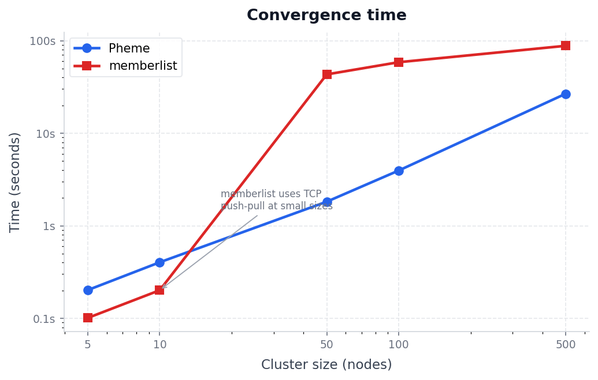
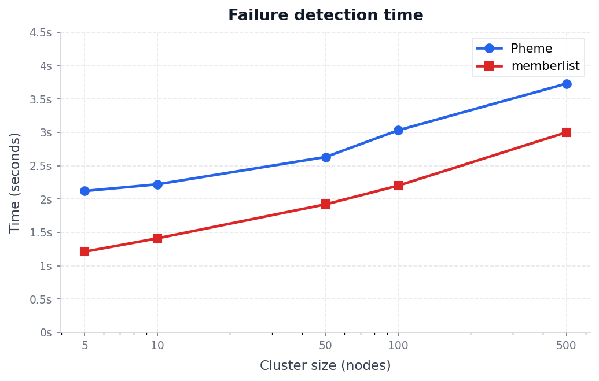
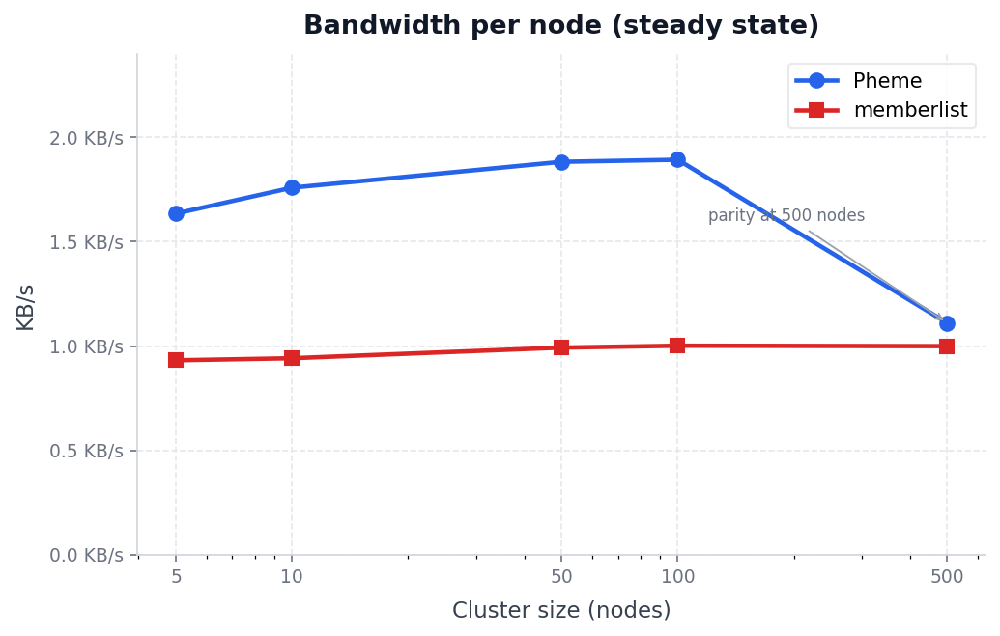

<p align="center">
  
</p>

# Pheme

Pheme is a sidecar gossip daemon that monitors a co-located service and disseminates membership state across a cluster using a SWIM-like protocol over UDP.

One instance runs alongside each service replica. Nodes find each other via seed addresses and exchange state through periodic UDP probes — no central coordinator, no TCP connections. Peer selection is zone-aware round-robin, which guarantees every peer is probed exactly once per cycle. State changes propagate via a retransmit queue bounded by `RetransmitMult × ⌈log₂(N+1)⌉` retransmits, keeping bandwidth flat as the cluster grows. Probe and suspicion timeouts are per-node and adapt from a sliding RTT window.

## Benchmarks

Measured on Apple Silicon macOS, loopback UDP. Both systems configured with `GossipInterval = ProbeInterval = 200 ms`, 3 indirect probes, suspicion multiplier 4.

> memberlist includes a TCP push-pull sync every 15 s (not counted in its bandwidth figures below). This explains why it converges faster at small cluster sizes — new nodes receive a full state snapshot over TCP immediately on join.

### Convergence time



At small sizes memberlist wins because of TCP push-pull. At 50+ nodes the tables turn: Pheme's retransmit queue gives priority to new state announcements, so they propagate before the next push-pull round would even fire.

| Nodes | Pheme  | memberlist |
|-------|--------|------------|
| 5     | 202 ms | 101 ms     |
| 10    | 403 ms | 201 ms     |
| 50    | 1.8 s  | 43 s       |
| 100   | 3.9 s  | 58 s       |
| 500   | 27 s   | ~88 s      |

### Failure detection time



Pheme is ~1.2–1.4× slower than memberlist. The gap comes from memberlist's [Lifeguard](https://arxiv.org/abs/1707.00788) dynamic awareness score and TCP fallback probes — mechanisms that add complexity Pheme intentionally omits.

| Nodes | Pheme  | memberlist |
|-------|--------|------------|
| 5     | 2.1 s  | 1.2 s      |
| 10    | 2.2 s  | 1.4 s      |
| 50    | 2.6 s  | 1.9 s      |
| 100   | 3.0 s  | 2.2 s      |
| 500   | 3.7 s  | ~3.0 s     |

### Bandwidth per node (steady state)



At 500 nodes bandwidth reaches parity. The ~1.8× overhead at smaller sizes comes from mandatory self-advertisement in every ping/ack (~50 bytes), which is the mechanism that guarantees pure-UDP convergence without any TCP state sync.

| Nodes | Pheme    | memberlist |
|-------|----------|------------|
| 5     | 1.6 KB/s | 0.9 KB/s   |
| 10    | 1.8 KB/s | 0.9 KB/s   |
| 50    | 1.9 KB/s | 1.0 KB/s   |
| 100   | 1.9 KB/s | 1.0 KB/s   |
| 500   | 1.1 KB/s | ~1.0 KB/s  |

## How It Works

Pheme implements a SWIM-like protocol:

1. **Probe** — every `GossipInterval` each node selects a peer via round-robin (zone-biased) and sends a UDP ping.
2. **Indirect probe** — if the direct ping times out, `IndirectChecks` random peers are asked to probe the target on behalf of the sender.
3. **Suspicion** — a node that fails direct and indirect probes transitions to `SUSPECT`. If it does not refute the suspicion within `SuspicionMultiplier × GossipInterval × log(N)`, it is marked `DEAD`.
4. **State dissemination** — every ping/ack carries a self-advertisement plus entries from a retransmit queue (priority: entries with most remaining retransmits first). This limits redundant traffic while guaranteeing new state changes propagate quickly.
5. **Health integration** — Pheme polls a local HTTP health endpoint. If the local service reports unhealthy, Pheme self-declares `SUSPECT` and eventually `DEAD`, notifying all peers even if the gossip port itself is reachable.

## Quick Start

```bash
# clone
git clone https://github.com/vladyslavpavlenko/pheme
cd pheme

# build
task build
# or: go build -o pheme ./main

# run a single node
./pheme -config config.example.yaml

# run tests
task test
```

### Running a local three-node cluster

```bash
# node 1 (bootstrap)
./pheme -id node1 -addr 127.0.0.1:7946 -api 127.0.0.1:7947

# node 2
./pheme -id node2 -addr 127.0.0.1:7948 -api 127.0.0.1:7949 -join 127.0.0.1:7946

# node 3
./pheme -id node3 -addr 127.0.0.1:7950 -api 127.0.0.1:7951 -join 127.0.0.1:7946

# query cluster status from node 1
curl http://127.0.0.1:7947/cluster/status
```

## Configuration

Copy [`config.example.yaml`](config.example.yaml) and adjust as needed. Every key can be overridden with an environment variable prefixed `PHEME_` (e.g. `PHEME_BIND_ADDR`, `PHEME_JOIN_ADDRS`).

```yaml
bind_addr: "0.0.0.0:7946"          # UDP gossip listen address
join_addrs: []                       # Seed addresses to join; can be a list
zone: "default"                      # Availability zone label
node_id: ""                          # Auto-generated UUID if empty

gossip_interval: 200ms               # Probe period
local_weight: 0.7                    # Fraction of probes aimed at same-zone peers
remote_weight: 0.3                   # Fraction of probes aimed at other zones
indirect_checks: 3                   # Peers asked to do indirect probes

suspicion_multiplier: 4              # Rounds before suspect → dead
rtt_window_size: 50                  # RTT samples used for adaptive timeouts

bloom_expected_items: 10000
bloom_fp_rate: 0.01
bloom_rotation_interval: 60s

healthcheck_url: "http://localhost:8080/health"
healthcheck_interval: 5s

api_addr: "0.0.0.0:7947"             # HTTP API listen address
```

### CLI Flags

| Flag      | Default                  | Description                                   |
|-----------|--------------------------|-----------------------------------------------|
| `-config` | —                        | Path to YAML config file                      |
| `-id`     | auto-generated UUID      | Node ID                                       |
| `-addr`   | `0.0.0.0:7946`           | UDP gossip bind address                       |
| `-api`    | `0.0.0.0:7947`           | HTTP API bind address                         |
| `-zone`   | `default`                | Availability zone label                       |
| `-join`   | —                        | Comma-separated seed addresses                |

### Ports

| Port | Protocol | Purpose        |
|------|----------|----------------|
| 7946 | UDP      | Gossip protocol |
| 7947 | TCP      | HTTP API        |

## HTTP API

| Method | Path               | Description                    |
|--------|--------------------|--------------------------------|
| GET    | `/cluster/status`  | All nodes with current state   |
| GET    | `/cluster/members` | Alive nodes only               |
| GET    | `/health`          | Pheme daemon health check      |

Example response for `/cluster/status`:

```json
[
  {"id": "node1", "addr": "127.0.0.1:7946", "zone": "us-east-1a", "state": "ALIVE", "version": 4},
  {"id": "node2", "addr": "127.0.0.1:7948", "zone": "us-east-1b", "state": "SUSPECT", "version": 2}
]
```

## Comparison with HashiCorp memberlist

[memberlist](https://github.com/hashicorp/memberlist) is a mature, battle-tested gossip **library** used in Consul, Nomad, and Serf. Pheme makes different trade-offs:

| Aspect                 | Pheme                              | memberlist                         |
|------------------------|------------------------------------|------------------------------------|
| Deployment model       | Standalone sidecar daemon          | Embedded library                   |
| Transport              | UDP only                           | UDP + TCP fallback + push-pull sync |
| Convergence (50+ nodes) | **3–24× faster**                 | Baseline                           |
| Failure detection      | ~1.2–1.4× slower                  | Baseline                           |
| Bandwidth (500 nodes)  | ~1.1 KB/s/node                    | ~1.0 KB/s/node                     |
| Zone awareness         | Built-in (configurable weights)    | Network coordinates (opt-in)       |
| Adaptive timeouts      | Phi Accrual–based per-node RTT    | Lifeguard (awareness score)        |
| Serialization          | Protocol Buffers                   | msgpack                            |
| Health integration     | Local HTTP polling → self-declare  | External delegate                  |
| Configuration          | YAML + env vars                    | Programmatic (Go struct)           |

## Contributing

This is a research project. The protocol is functional and benchmarked, but it is not production-hardened. Improvements are welcome — open an issue or send a PR.

Areas that would most benefit from work: UDP packet compression (snappy/zstd), [vtprotobuf](https://github.com/planetscale/vtprotobuf) for faster serialisation, Lifeguard-style dynamic probe-interval adaptation, TCP fallback probes, and a Prometheus metrics endpoint.

## License

MIT
